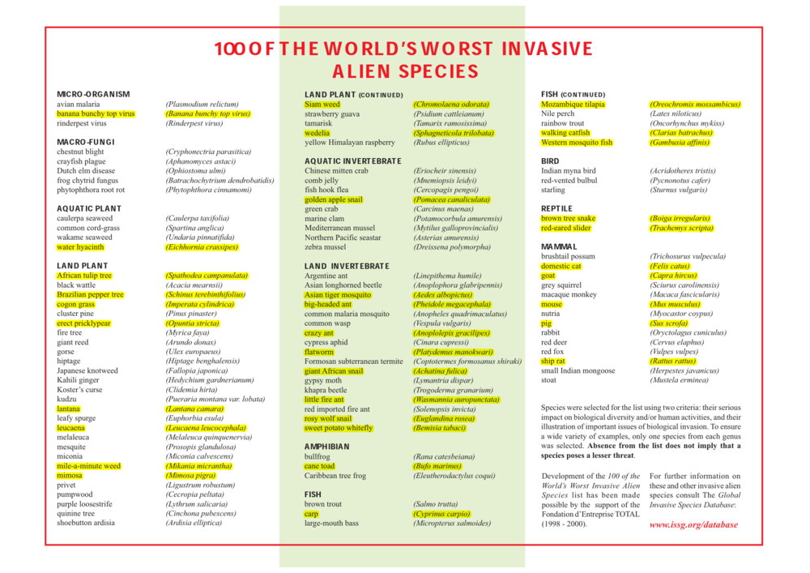
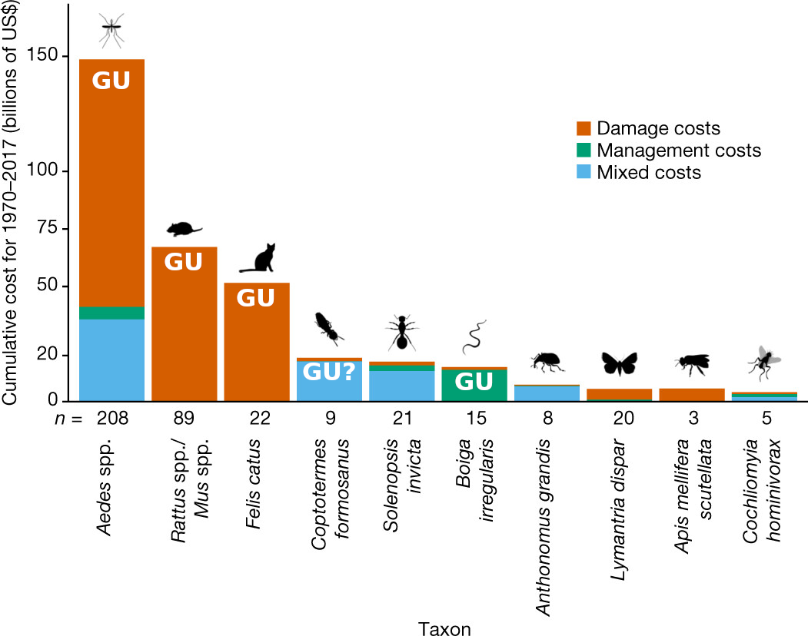

# DRAFT: How Bad is Guam's Invasive Species Status from a Global Perspective?
**[Aubrey Moore](mailto://aubreymoore@triton.uog.edu), University of Guam**

Guam has become quite infamous as an island heavily impacted by invasive species mainly because of the brown treesnake.  But is this notariety justified? I have come across a couple of lists which may be useful in developing a global perspective for the invasive species status on Guam. 

* [100 of the World's Worst Invasive Alien Species](http://issg.org/database/species/reference_files/100English.pdf) was published by the Invasive Specialist Group of the World Conservation Union (IUCN) in 2000.
Species were selected for the list according to two criteria: their serious impact on biological diversity and/or  human activities, and their illustration of important issues surrounding biological invasion. **Guam has 33 out of 100 taxa in a list.**

* [World's Most Costly Invasive Species](https://www.biodiversitydynamics.fr/wp-content/uploads/2021/03/InvaCostNature.pdf) was published by Diagne et al. in 2021. This list is ranked by the sum of damage and management costs for each taxon between 1970 and 2017. **Guam has 5 out of 10 taxa in a list.**

But how do these numbers compare to those for other islands? I am currently counting taxa in these lists which occur on other tropical islands for comparison. Come back here soon to see results. 

## 100 of the World's Worst Invasive Alien Species

## World's Most Costly Invasive Species

On March 21, 2021, Diagne et al. published an article in *Nature* entitled [*Status of the World's Most Costly Invasive Species*](https://www.biodiversitydynamics.fr/wp-content/uploads/2021/03/InvaCostNature.pdf). In this article, they presented a figure showing costs associated with ten of the most costly taxa of invasive species, which includes seven insects, two mammals and one snake (You guessed it. It's the brown treesnake.) 

Below, I have annotated their figure to indicate which taxa occur on Guam.

### Figure 5 from [Diagne et al. 2021](https://doi.org/10.1038/s41586-021-03405-6), annotated by Moore to indicate occurrence on Guam.

**Fig. 5** The 10 costliest taxa from the most robust subset of the original database for both cumulative damage and management costs (in billions of 2017 US dollars) between 1970 and 2017. Mixed costs are cost estimates for which the specific monetary contribution of damage and management costs could not be disentangled from the reporting studies. Each bar represents a species or a complex of species (when different species were often considered simultaneously to provide cost estimates). Numbers below the bars indicate the number of cost estimates. This ranking illustrates the limits of the available data and the need for more thorough and standardized cost reports (Supplementary Discussion 1). All animal silhouettes were obtained from an open source platform (http://phylopic.org/). The silhouette of *Coptotermes* was created by Melissa Broussard.

**GU** indicates that a taxon occurs on Guam.

### Taxon Notes

* [*Aedes* spp.](https://en.wikipedia.org/wiki/Aedes) Members of the genus *Aedes* are known vectors for numerous viral infections. The two most prominent species that transmit viruses are *A. aegypti* and *A. albopictus,* which transmit the viruses that cause dengue fever, yellow fever, West Nile fever, chikungunya, eastern equine encephalitis, and Zika virus, along with many other, less notable diseases. A search of the Global Biodiversity Information Facility (GBIF) database indicates that there are four species of *Aedes* mosquitoes currently on Guam: *A. pandani*, *A.albopictus*, *A. hensilli*, and *A. guamensis* ([GBIF search results](https://doi.org/10.15468/dl.7atvrc)). *A.aegyti* was previously present, but this is one of the very few invasive species successfully eradicated from the island. 

* [*Rattus* spp.](https://en.wikipedia.org/wiki/Rattus) / [*Mus* spp.](https://en.wikipedia.org/wiki/Mus_(genus)) Five species of rodents in these genera are currently on Guam: *R. exulans*, *R.norvegicus*, *R. rattus*, *R. tanezumi*, *M. musculus* ([GBIF search results](https://doi.org/10.15468/dl.7atvrc)).

* [*Felis catus*](https://en.wikipedia.org/wiki/Cat), domestic cats, are abundant on Guam in domestic and feral populations. However,  GBIF contains no Guam records for cats ([GBIF search results](https://doi.org/10.15468/dl.7atvrc))

* [*Coptotermes formosanus*](https://en.wikipedia.org/wiki/Formosan_subterranean_termite), the Formosan subterranean termite, has been reported from Guam. However, a survey by Su and Sch [5] found only *C. gestroi* (syn. *C.vastator*) and suggested that previous identifications of Guam specimens as *C. formosanus* were erroneous. 

* [*Solenopsis invicta*](https://en.wikipedia.org/wiki/Red_imported_fire_ant), red imported fire ant, is not reported from Guam. However, the *S. geminata* the tropical fire ant is common. 

* [*Boiga irregularis*](https://en.wikipedia.org/wiki/Brown_tree_snake), brown treesnake (BTS), is abundant on Guam.  Occurrence on Guam represents the only documented reproductive population outside the native range of this snake. BTS is unique in this figure as being the only taxon in which management costs exceed all other costs. Much of the BTS management costs are used used to to prevent accidental export BTS from Guam, rather than on managing the pest on Guam. 

* [*Anthonomus grandis*](https://en.wikipedia.org/wiki/Boll_weevil), cotton boll weevil, is not reported from Guam.

* [*Lymantria dispar*](https://en.wikipedia.org/wiki/Lymantria_dispar), European gypsy moth is not reported from Guam.

* [*Apis mellifera scutellata*](https://en.wikipedia.org/wiki/African_bee), East African lowland honeybee, is a subspecies of the western honey bee which has been determined to constitute one part of the ancestry of the Africanized bees spreading through America. There is no record of *A. mellifera scutellata* on Guam and there is no evidence of Africanization of domestic or feral populations of *A. mellifera* on Guam.

* [*Cochliomyia hominivorax*](https://en.wikipedia.org/wiki/Cochliomyia_hominivorax), New World screw-worm fly, is not reported from Guam.

### References

[1] GBIF.org (4 April 2021) GBIF Occurrence Download https://doi.org/10.15468/dl.7atvrc

[2] Diagne, Christophe, Boris Leroy, Anne-Charlotte Vaissière, Rodolphe E. Gozlan, David Roiz, Ivan Jarić, Jean-Michel Salles, Corey J. A. Bradshaw, and Franck Courchamp. “High and Rising Economic Costs of Biological Invasions Worldwide.” Nature, March 31, 2021, 1–6. https://doi.org/10.1038/s41586-021-03405-6.

[3] Wikipedia contributors. (2021, April 1). African bee. In Wikipedia, The Free Encyclopedia. Retrieved 00:39, April 5, 2021, from https://en.wikipedia.org/w/index.php?title=African_bee&oldid=1015512213

[4] Wikipedia contributors. (2021, April 1). Aedes. In Wikipedia, The Free Encyclopedia. Retrieved 01:03, April 5, 2021, from https://en.wikipedia.org/w/index.php?title=Aedes&oldid=1015398992

[5] Su

[readonly link](https://www.nature.com/articles/s41586-021-03405-6.epdf?sharing_token=gzAIS34eQrFgpg6755NR9NRgN0jAjWel9jnR3ZoTv0N-hjc_skiWnPirhq64a5g9G8FoO2H0zrGElFjOf25pdvBarBVWKpyVc4jJeaw5SUrONw3ngCedft-uNLJQKdH_zr8n3z-cnlZHS9Q5JV34q9vMLLF7xtWbZPnfYRMSH3s%3D)

